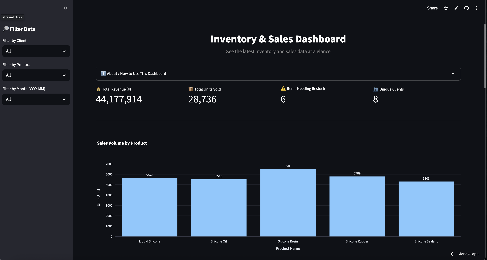
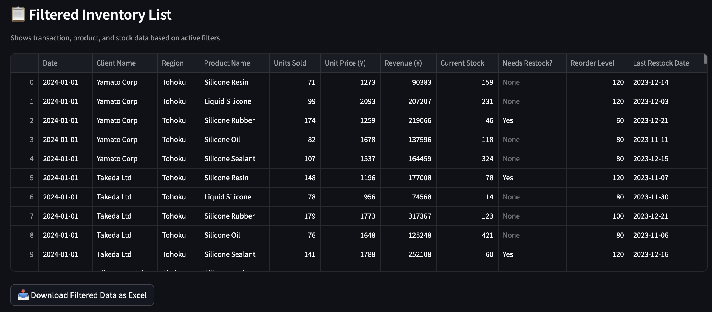
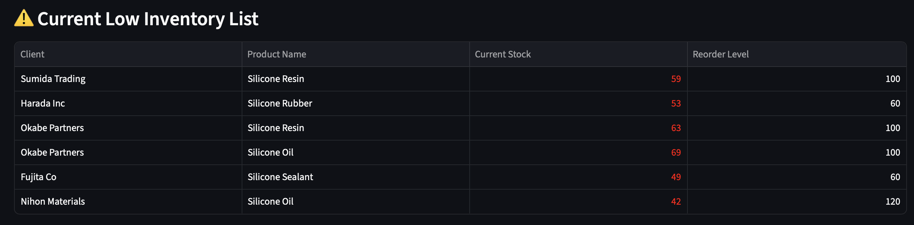

# 📦 NISSILI Inventory & Sales Dashboard

[](https://nissili-demo-dashboard.streamlit.app/)

A bilingual (🇯🇵/🇺🇸) inventory and sales dashboard built with **Streamlit**, featuring real-time filtering, visual analytics, Excel export, and simulated email alerts for low stock. This tool empowers teams to track stock levels, detect sales trends, and take action—all without touching Excel.

---

## 🏢 Business Context

NISSILI is a Japanese silicone trading company with multiple product lines and clients across regions. This dashboard was built to address key operational needs:

- Instantly view up-to-date inventory and sales data
- Identify stock shortages before they cause delays
- Eliminate the need to manually manage Excel spreadsheets
- Provide a professional tool that managers, sales reps, and warehouse teams can use without technical training

---

## 💡 Features

- **🔀 Language Toggle**: Switch between Japanese and English seamlessly
- **📈 Visual Analytics**: Bar charts, line graphs, and KPIs to monitor performance
- **🔎 Advanced Filtering**: Filter data by client, product, or transaction month
- **📋 Filtered & Full Tables**: View both scoped and complete inventory data
- **📥 Download as Excel**: Export filtered data instantly in `.xlsx` format
- **⚠️ Low Stock Alerts**: Auto-detects items below reorder levels
- **📧 Simulated Email Notifications**: Preview of automated alerts for restock events
- **🌐 Responsive UI**: Adapts to mobile and desktop, auto-matches the user’s system theme (dark or light)

---

## 🖼️ Feature Previews

| Dashboard Overview | Excel Download | Low Inventory | Simulated Email |
|--------------------|--------------|----------------|------------------|
|  |  |  |  |

---

## 🛠️ Tech Stack

- **Python** & **Pandas** (data handling)
- **Streamlit** (UI, interactivity, and data rendering)
- **Plotly** (interactive charts)
- **SQLAlchemy + SQLite** (data storage and querying)
- **OpenPyXL** (Excel export functionality)
- **Pillow** (image/logo conversion to base64 for UI embedding)

---

## 📝 How to Use

1. Select a language (日本語 or English)
2. Use the sidebar filters to narrow by client, product, or month
3. Explore KPIs and visualizations to understand stock and sales
4. Scroll down to view the filtered table
5. Click “Download as Excel” to export the data
6. See the “Simulated Email Notification” preview if low inventory is detected
7. Expand “Show All Inventory Data” to view the entire dataset

---

## 📦 Installation

```bash
git clone https://github.com/TomCat-415/nissili_data_demo.git
cd nissili_data_demo
pip install -r requirements.txt
streamlit run app.py

---

## 🤝 Contact

Thomas Haruo Clinard
[thomasharuo415@gmail.com](mailto:thomasharuo415@gmail.com)
📍 Tokyo, Japan | 2025
