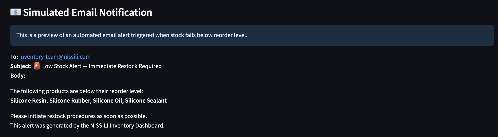

# 📦 NISSILI Inventory & Sales Dashboard

[](https://nissili-demo-dashboard.streamlit.app/)


A bilingual (🇯🇵/🇺🇸) inventory and sales dashboard built with **Streamlit**, featuring real-time filtering, visual analytics, Excel export, and simulated email alerts for low stock. This tool empowers teams to track stock levels, detect sales trends, and take action—all without touching Excel.

This project started as a proof-of-concept for how a bilingual inventory system could work for a company like NISSILI. I wanted to explore how far I could go using Python and Streamlit to build something clean, usable, and impactful — without relying on Excel or Google Sheets. I learned a lot about streamlining UX, data filtering, and simulating real-world alerts along the way.

---

## 🏢 Business Context

NISSILI is a Japanese silicone trading company with multiple product lines and clients across regions. This dashboard was built to address key operational needs:

- Instantly view up-to-date inventory and sales data
- Identify stock shortages before they cause delays
- Eliminate the need to manually manage Excel spreadsheets
- Provide a professional tool that managers, sales reps, and warehouse teams can use without technical training

---

## 💡 Features

- 🌐 **Language Toggle**: Switch between Japanese and English seamlessly  
- 📊 **Visual Analytics**: Bar charts, line graphs, and KPIs to monitor performance  
- 🎯 **Advanced Filtering**: Filter data by client, product, or transaction month  
- 🧾 **Filtered & Full Tables**: View both scoped and complete inventory data  
- 📁 **CSV Upload (Additive)**: Upload new inventory CSVs via sidebar — new entries are merged with existing data in real time  
- 📥 **Download as Excel**: Export filtered data instantly in `.xlsx` format  
- ⚠️ **Low Stock Alerts**: Auto-detects items below reorder levels  
- ✉️ **Simulated Email Notifications**: Preview of automated alerts for restock events  
- 📱 **Responsive UI**: Adapts to mobile and desktop, auto-matches the user’s system theme (dark or light)

---

## 🖼️ Feature Previews

| Dashboard Overview | Excel Download | Low Inventory | Simulated Email |
|--------------------|--------------|----------------|------------------|
|  |  |  |  |

---

## 🛠️ Tech Stack

- **Python** & **Pandas** (data handling)
- **Streamlit** (UI, interactivity, and data rendering)
- **Plotly** (interactive charts)
- **SQLAlchemy + SQLite** (data storage and querying)
- **OpenPyXL** (Excel export functionality)
- **Pillow** (image/logo conversion to base64 for UI embedding)

---

## 📝 How to Use

1. Select a language (日本語 or English)
2. Use the sidebar filters to narrow by client, product, or month
3. Explore KPIs and visualizations to understand stock and sales
4. Scroll down to view the filtered table
5. Click “Download as Excel” to export the data
6. See the “Simulated Email Notification” preview if low inventory is detected
7. Expand “Show All Inventory Data” to view the entire dataset

---

## 📦 Installation

```bash
git clone https://github.com/TomCat-415/nissili_data_demo.git
cd nissili_data_demo
pip install -r requirements.txt
streamlit run app.py
```

---

## 📈 Future Enhancements

- 🔗 Backend automation using Supabase or Zapier  
- 📤 Real-time alerts via email or Slack when restock is needed  
- 🔐 Role-based access (admin vs viewer)  
- 📊 Monthly forecasting with linear regression  
- 📱 Mobile-first redesign designed for field sales teams

I'd love to eventually connect this dashboard to a real backend (like Supabase or Firebase).

---

## 📄 License

This project is licensed under the [MIT License](LICENSE).

---

## 🤝 Contact

**Thomas Haruo Clinard**  
📧 [thomasharuo415@gmail.com](mailto:thomasharuo415@gmail.com)
📍 Tokyo, Japan · 2025  

If you’re working on similar tools or want to chat Streamlit dashboards, feel free to reach out.
